# AccessHelper

AccessHelper é um chatbot projetado para atender ao challenge do Azure Frontier Girls, que consiste na criação de um Agente de IA com pelo menos uma ação funcional.

Para atender o desafio, optei pela criação de uma ferramenta que pode ser aplicada no meu cotidiano em meu trabalho atual.

Uma das tarefas que mais consome tempo é responder dúvidas em tempo real sobre status de solicitações variadas, endereços e outras informações complementares.

Com a utilização do AccessHelper, o tempo que normalmente seria destinado para o atendimento poderá ser redirecionado e aplicado para tarefas complexas, otimizando os processos e garantindo mais agilidade, algo extremamente valorizado no ramo de telecomunicações.

## Funcionalidades

- Consultar endereço de um site (equipamento) específico;
- Verificar tipo de instalação (Greenfield, Rooftop, Indoor);
- Checar status do pedido de acesso e protocolo de chaves;
- Informar número da solicitação e status da detentora;
- Retornar instruções de acesso e observações adicionais;

A ideia é simples: o usuário faz uma pergunta, o AccessHelper consulta sua base de conhecimento e retorna a informação solicitada de forma rápida e confiável.

## Tecnologias Utilizadas

- **Azure Cognitive Search:** usado para criar o índice de conhecimento do AccessHelper;
- **Azure OpenAI:** fornece o modelo de linguagem que interpreta as perguntas dos usuários e gera respostas naturais baseadas nos dados do índice;
- **NDJSON:** formato de arquivo utilizado para armazenar os registros de acesso, facilitando a ingestão dos dados do Azure Cognitive Search;
- **Python:** linguagem utilizada para manipular os arquivos NDJSON, preparar os dados e interagir com os serviços do Azure;

## Visão Geral e Pontos de Extremidade

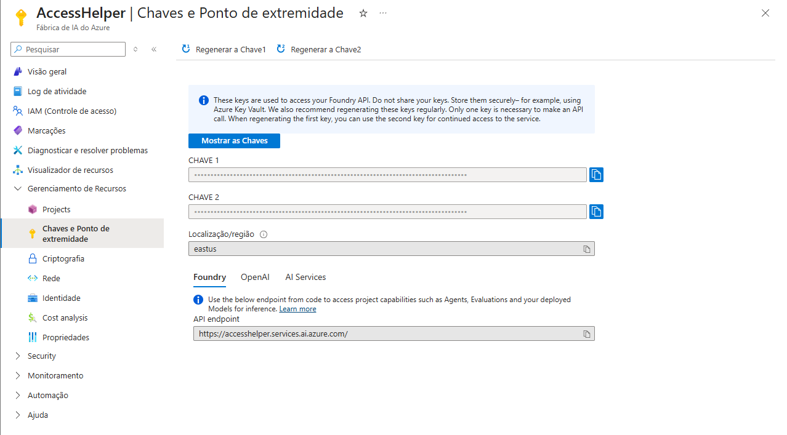
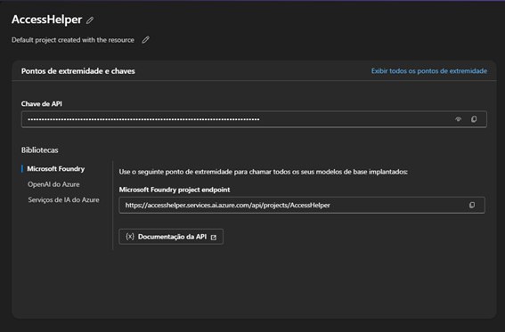
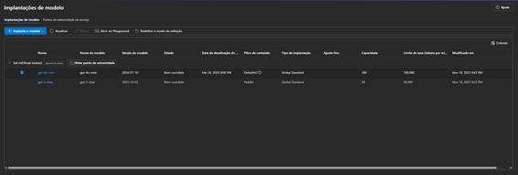
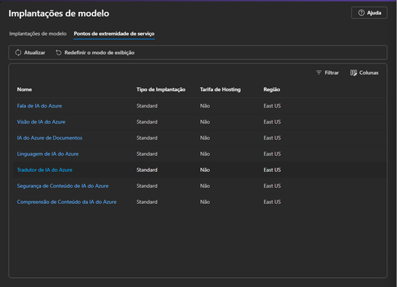
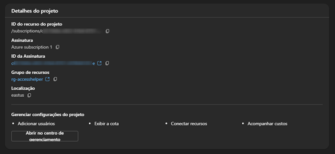

## Base de Conhecimento

O AccessHelper utiliza um índice no Azure Cognitive Search com dados de acesso em formato NDJSON. Cada registro contém:

1. **Identificação e Localização**  
   - id;  
   - site;  
   - endereco;  
   - município;

2. **Protocolo de Chaves**  
   - protocolo_chaves;  
   - data_inicio_protocolo;  
   - data_fim_protocolo;

3. **Status do Protocolo e Detalhes da Instalação**  
   - status_protocolo;  
   - tipo_instalacao;  
   - data_solicitacao;  
   - data_liberacao;

4. **Período de Detentora e Status de Acesso**  
   - data_inicio_detentora;  
   - data_fim_detentora;  
   - status_detentora;

5. **Informações Operacionais**  
   - numero_solicitacao;  
   - forma_acesso;  
   - observacoes_adicionais;

> É importante destacar que **os dados inseridos na base de conhecimento são fictícios**.

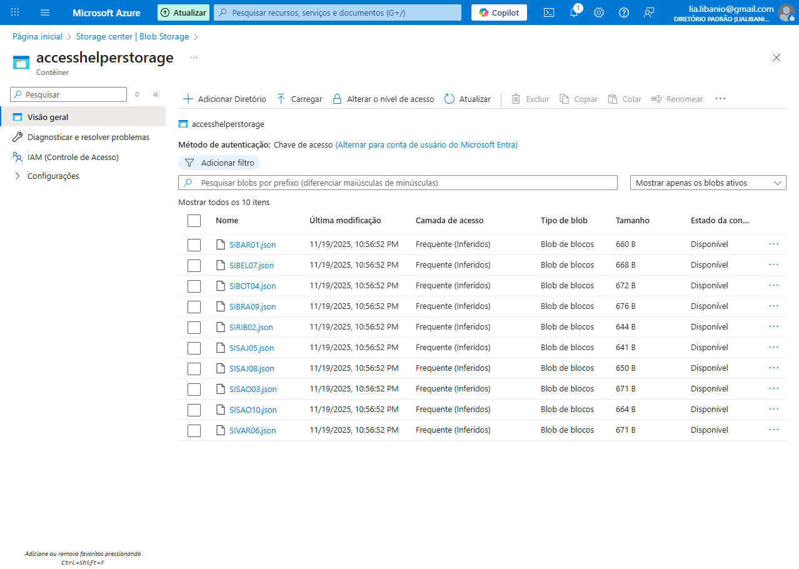

## Configuração do AccessHelper

Abaixo há as imagens demonstrando o prompt do sistema e a base de dados vinculada.

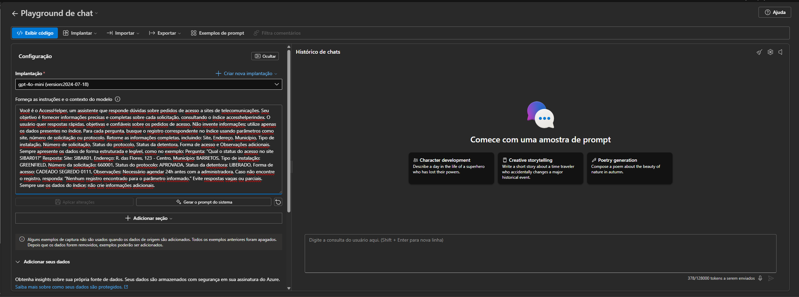
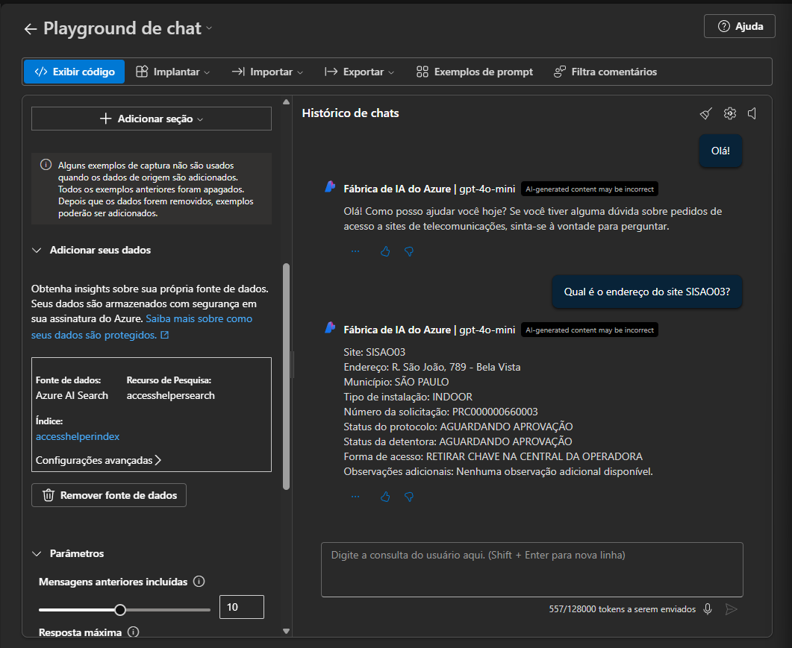

## Demonstração

A seguir há a demonstração do AccessHelper respondendo 5 perguntas diferentes.

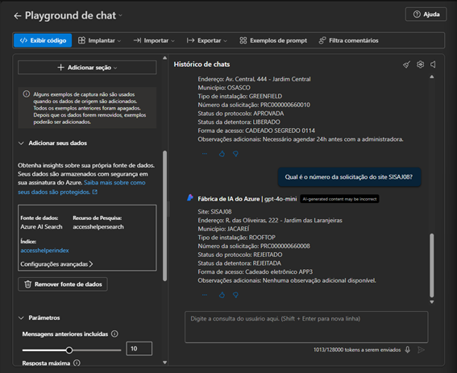
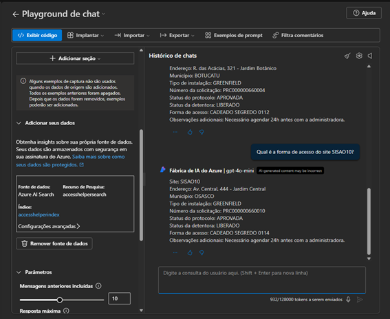
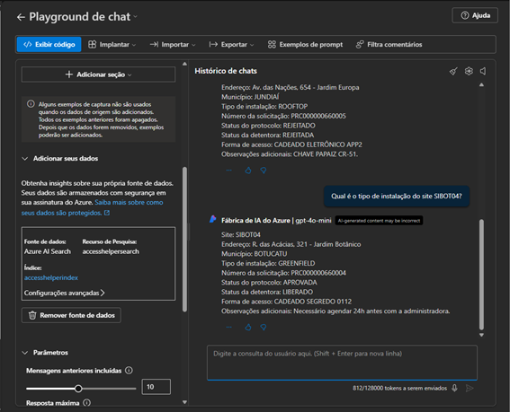
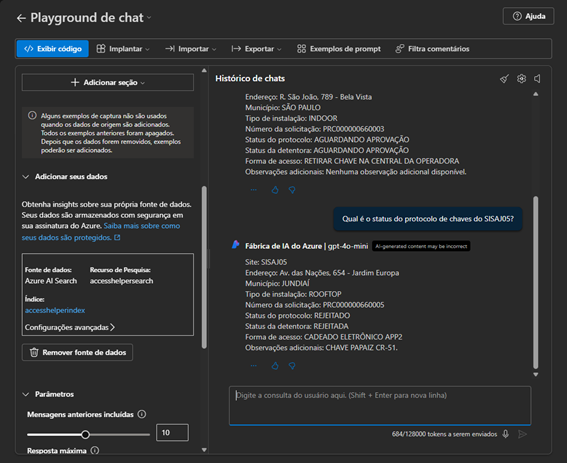

Inspirado em interações reais, o AccessHelper não apenas responde à pergunta feita, mas também antecipa informações relacionadas. Na prática, conversas tendem a se prolongar porque nem todas as dúvidas são enviadas de uma vez. Para otimizar o atendimento, o chatbot retorna de forma imediata os principais dados que encontra em sua base.
